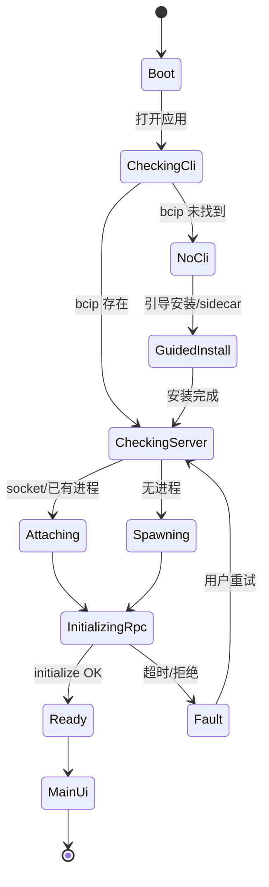
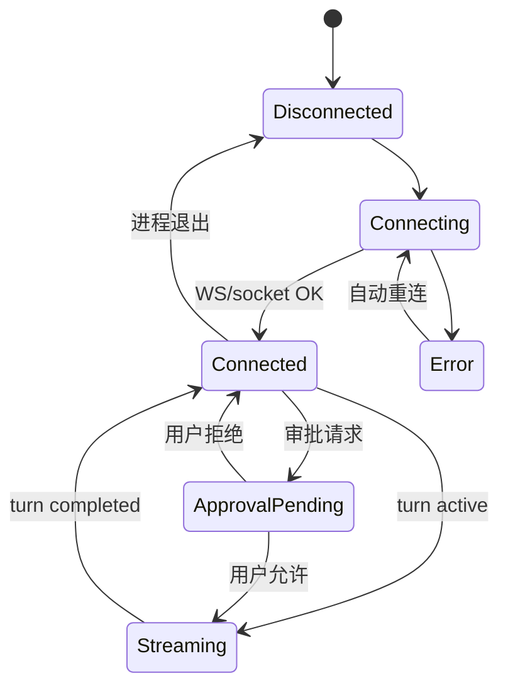
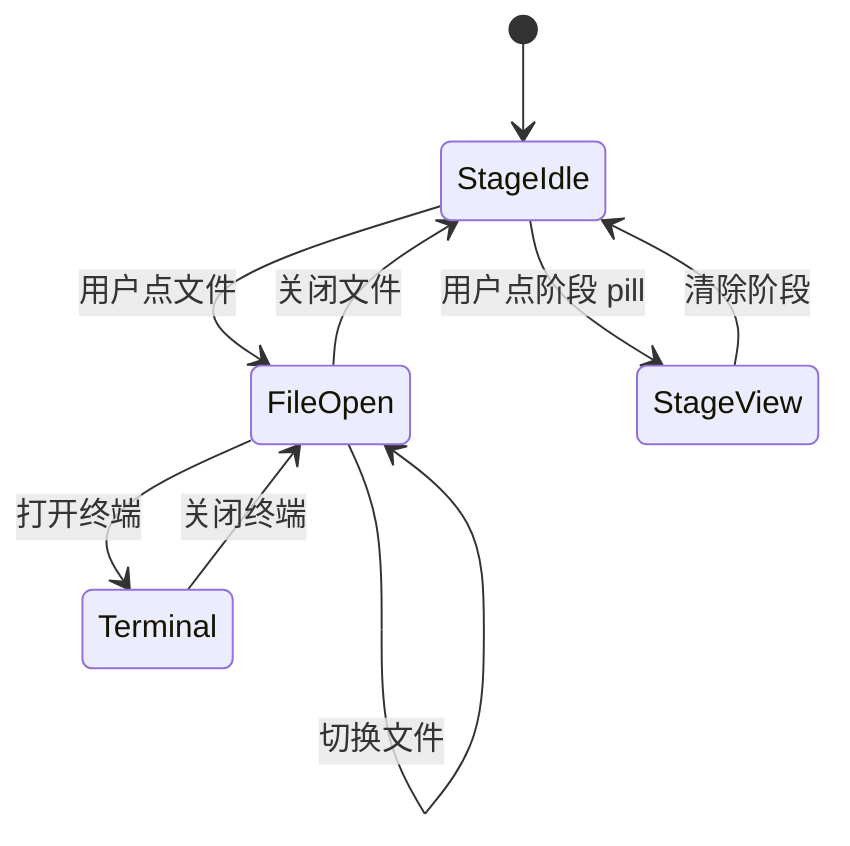

# BCIP 桌面端设计稿规范（Figma / 设计交付）

**日期**: 2026-05-30
**状态**: 设计稿专用（不含开发实现）
**依赖策略**: `docs/plans/2026-05-30-desktop-codex-parity-strategy.md`
**依赖壳层**: `docs/plans/2026-05-30-desktop-redesign.md`
**落地计划**: `docs/plans/2026-05-30-desktop-implementation-plan.md`
**设计基准分辨率**: 1400 × 900（最小 900 × 650）
**平台优先**: macOS（透明标题栏 + 交通灯），Windows 为 P2 变体帧

---

## 1. 设计目标（给设计师一句话）

在 **Codex 官方桌面/扩展的会话与配置体验上做到组件级可对照（≥90%）**，外层保留 **BCIP 专利三栏工作区**（项目树、文书预览、工作流阶段、Todo）；所有 MCP/技能/模型配置 **视觉上是一套「设置」**，逻辑上对应 `config.toml`（用户已在 TUI 配好的应零步复现）。

---

## 2. Figma 文件结构

建议单文件 **`BCIP Desktop v2`**，按 Page 分页：

| Page | 内容 |
|------|------|
| **00 Cover** | 版本、日期、链接策略文档、色板 |
| **01 Foundations** | 色板、字体、栅格、圆角、 elevation、动效时长 |
| **02 Components** | 原子组件 + Codex parity 组件（见 §4） |
| **03 Shell** | 标题栏、状态栏、三栏骨架、resize 手柄 |
| **04 Main — Workspace** | 中心工作区（阶段条、预览、Todo、终端） |
| **05 Main — Agent** | 右侧 Agent 面板（线程 + 消息 + 输入） |
| **06 Settings** | 全屏设置（Codex 对标） |
| **07 Onboarding** | 首次启动 / 无 CLI / 连接失败 |
| **08 Overlays** | 审批、MCP OAuth、elicitation、命令面板 |
| **09 States** | 空态、加载、错误、断线重连 |
| **10 Codex Diff** | 与 Codex 截图并排对照表（走查用） |

**Frame 命名规范**: `{Page}/{Screen}/{State}`，例：`05 Main — Agent/ThreadActive/ApprovalPending`。

---

## 3. 信息架构（IA）

```
BCIP Desktop
├── 主壳（常驻）
│   ├── TitleBar（拖拽区 + 交通灯 + 全局操作）
│   ├── LeftSidebar（项目 | 文件）
│   ├── CenterWorkspace（阶段 | 预览/编辑 | Todo | 终端 overlay）
│   ├── AgentPanel（线程列表折叠区 + 会话 + 输入）
│   └── StatusBar（连接 | 用量 | 模型 | 主题）
├── 设置（路由 /settings，可模态或全屏）
│   ├── 通用
│   ├── 模型与推理
│   ├── 审批与沙箱
│   ├── MCP 服务器
│   ├── 技能
│   ├── 插件（Experimental）
│   ├── 编辑器与外观
│   ├── 快捷键
│   └── 关于与诊断
└── 首次引导（仅首启或故障）
    ├── 检测 bcip
    ├── 附着 app-server
    └── 选择项目目录
```

**原则**: Agent 会话 **只有右侧一处**；中心永不出现第二套聊天气泡（与 redesign 一致）。

---

## 4. 组件树（设计系统）

### 4.1 Foundations（与现网 token 对齐）

设计稿 **必须**使用下列语义色（实现已存在于 `apps/desktop/src/index.css`），Figma 建 Variable Collection `semantic/`：

| Token | Light | 用途 |
|-------|-------|------|
| `bg/base` | #F5F2EE | 主背景 |
| `bg/surface` | #FAF8F5 | 面板底 |
| `bg/elevated` | #FFFFFF | 卡片、输入 |
| `bg/sidebar` | rgba(245,242,238,0.72) | 侧栏玻璃 |
| `text/primary` | #1A1814 | 正文 |
| `text/secondary` | #6B6560 | 说明 |
| `text/tertiary` | #A39E98 | 占位、时间 |
| `accent/primary` | #4A7C6F | 主色（专利品牌绿） |
| `accent/cyan` | #3A8B8C | 流式光标、链接 |
| `status/success` | #4A7C6F | 已连接 |
| `status/warning` | #B8923A | 连接中 |
| `status/error` | #B85C50 | 失败 |

**字体**

| 角色 | 字体 | 字号 / 行高 |
|------|------|-------------|
| UI | Inter | 12–14 / 1.5–1.6 |
| 代码 / 路径 | JetBrains Mono | 11–12 / 1.4 |
| 标题栏 | Inter Semibold | 13 |

**圆角**: 6（控件）、10–12（气泡）、20（阶段 pill）、50%（交通灯）。

**动效**: 150ms hover；250–350ms 面板展开；流式光标 1s step（与现 RightPanel 一致）。

### 4.2 Shell 组件

```
AppShell
├── TitleBar
│   ├── TrafficLights (macOS only)
│   ├── AppTitle
│   ├── WorkspaceBreadcrumb（可选：项目名 / 文件名）
│   └── TitleBarActions（主题、设置、搜索）
├── PanelResizeHandle（4px 热区，hover 显示 accent 线）
├── StatusBar
│   ├── ConnectionChip
│   ├── UsageMeter（token/费用，有数据时显示）
│   ├── ModelChip
│   └── StatusBarActions
└── ToastRegion（sonner 占位）
```

### 4.3 左侧 — 项目 / 文件

```
LeftSidebar
├── SidebarHeader（收起钮 + Tab：项目 | 文件）
├── ProjectTab
│   ├── NewProjectButton
│   ├── ProjectSearch
│   └── ProjectTree
│       └── ProjectNode → FileTree（递归）
├── FilesTab
│   ├── PathBreadcrumb
│   └── FileTree
└── SidebarFooter（磁盘空间 / 同步状态，P2）
```

### 4.4 中心 — 专利工作区（BCIP 差异化）

```
CenterWorkspace
├── WorkspaceToolbar
│   ├── StageIndicator（检索→对比→审查→起草）
│   ├── OpenFileTab（有文件时替换阶段条）
│   └── TerminalToggle
├── WorkspaceBody（互斥）
│   ├── FilePreviewRouter
│   │   ├── PdfViewer + AnnotationToolbar（P1）
│   │   ├── MarkdownSplit（编辑 | 预览，P1）
│   │   ├── DocxViewer
│   │   ├── ImageViewer
│   │   └── Code/TextViewer
│   ├── StageEmpty（无文件、无阶段：引导文案）
│   └── TerminalOverlay（全屏覆盖中心，非第三栏）
└── TodoDock（底部，可折叠，高默认 120–160px）
    ├── TodoHeader（标题 + 折叠）
    ├── TodoList
    └── TodoAddInline
```

**阶段 pill 状态**

| 视觉 | 含义 |
|------|------|
| 空心灰 | 未激活 |
| 实心绿边 + 浅绿底 | 当前阶段 |
| 实心绿 + ✓ | 已完成（可选，由 Agent 事件驱动） |

### 4.5 右侧 — Codex Parity Agent 面板（核心对标）

```
AgentPanel
├── AgentHeader
│   ├── ThreadSelector（下拉或图标展开线程列表）
│   ├── UsageStrip（与 Codex 顶部用量条同位置）
│   └── PanelMenu（新建线程、归档、设置入口）
├── ThreadListDrawer（可选左侧窄条，对标 Codex 历史）
│   └── ThreadRow（title、preview、time、status dot）
├── MessageTimeline
│   ├── SystemLine（居中 11px italic）
│   ├── UserBubble（右对齐，max 85% 宽）
│   ├── AgentBlock（左对齐，左边框 2px，流式时 cyan 边）
│   ├── ReasoningBlock（可折叠，dim，对标 Codex reasoning）
│   ├── ToolCallCard（见 4.6）
│   └── TurnDivider（turn 结束，可选显示 token）
├── Composer
│   ├── AttachmentButton
│   ├── SlashCommandPalette（输入 `/` 唤起）
│   ├── MultilineInput（max-h 200px）
│   └── SendButton（Enter 发送，Shift+Enter 换行）
└── AgentFooter
    ├── ConnectionStatus（图标 + 文案 + 点击诊断）
    └── ModelBadge（当前模型，点击跳转设置）
```

### 4.6 Codex Parity — 条目卡片（必须单独画组件）

| 组件 | 触发来源（实现时用） | 设计要点 |
|------|----------------------|----------|
| `ToolCallCard` | `item` tool / command | 标题行：图标 + 工具名 + 状态 spinner/done/fail；可展开 stderr/stdout |
| `McpToolCallCard` | `mcpToolCall` | 显示 server 名、tool 名、plugin 徽章 |
| `FileChangeCard` | patch / file edit item | diff 摘要 + 「查看变更」 |
| `ApprovalDialog` | command/file approval | 危险操作用 `status/error` 描边；主按钮「允许一次/会话」 |
| `McpElicitationModal` | `mcpServer/elicitation/request` | 表单字段 1–3 个，与 Codex 表单项宽一致 |
| `OAuthWaitingSheet` | `mcpServer/oauth/login` | 说明 + 打开浏览器 + 等待 completed 通知 |

### 4.7 设置页（Codex 对标 — 每节一 Frame）

```
SettingsLayout
├── SettingsNav（左侧 200px 固定）
└── SettingsContent
    ├── GeneralSettings
    ├── ModelSettings（数据来自 model/list，设计中用占位「从服务端加载」）
    ├── ApprovalSandboxSettings
    ├── McpServersSettings
    │   ├── ServerRow（name、status、tool count、OAuth）
    │   ├── AddServerWizard
    │   └── JsonEditorFallback（高级）
    ├── SkillsSettings
    │   ├── SkillRow（enable toggle、path、cwd scope）
    │   └── SkillPreviewDrawer
    ├── PluginsSettings（角标 Experimental）
    ├── AppearanceSettings
    ├── ShortcutsSettings
    └── AboutDiagnostics（版本、日志、打开 config 路径）
```

**MCP 行状态色**

| status | 色 |
|--------|-----|
| starting | warning + spinner |
| ready | success |
| failed | error + 展开 error 文案 |
| cancelled | tertiary |

---

## 5. 关键屏幕线框（ASCII）

### 5.1 默认主界面（1400×900）

```
┌─ TitleBar ──────────────────────────────────────────────── theme ⚙ ─┐
│ ●●●  云熙 · 智能电池管理系统                    [检索][对比][审查][起草] │
├──────────┬──────────────────────────────────────┬───────────────────┤
│ 项目|文件 │  claims.md                    [终端] │ 线程 ▾  ¥2.35/50   │
│ + 新建   │ ┌──────────────────────────────────┐ │ ┌─────────────────┐ │
│ ▼ 案件A  │ │                                  │ │ │ User bubble     │ │
│   claims │ │     Markdown / PDF 预览区         │ │ │ Agent stream    │ │
│   OA.pdf │ │                                  │ │ │ [Tool card]     │ │
│          │ └──────────────────────────────────┘ │ └─────────────────┘ │
│          │ ☐ 分析权利要求1  ☐ 对比D1  [+待办]   │ 📎 [输入...]  [发送]│
├──────────┴──────────────────────────────────────┴───────────────────┤
│ ● 已连接 · 共用终端配置    费用 ████░░    main · gpt-5.x    ☾      │
└──────────────────────────────────────────────────────────────────────┘
     260px              flex 1                         380px (联动宽)
```

### 5.2 设置 — MCP（对标 Codex）

```
┌─ 设置 ─────────────────────────────────────────────────────────────┐
│ 通用          │  MCP 服务器                    [+ 添加] [重新加载]   │
│ 模型          │  ┌─────────────────────────────────────────────┐  │
│ 审批与沙箱 ◄  │  │ ● filesystem   ready   12 tools    [OAuth] │  │
│ MCP 服务器    │  │ ○ github       failed  —          [重试]  │  │
│ 技能          │  └─────────────────────────────────────────────┘  │
│ 插件 ⚗        │  编辑 config.toml 高级 ▸                           │
└───────────────┴──────────────────────────────────────────────────┘
```

### 5.3 审批浮层（全局 Modal，z-index 最高）

```
        ┌─────────────────────────────────────┐
        │  允许执行命令？                      │
        │  $ npm test                         │
        │  工作目录: ~/Projects/case-001      │
        │  [ 拒绝 ]  [ 允许一次 ] [ 始终允许 ] │
        └─────────────────────────────────────┘
```

---

## 6. 状态图（设计需画全状态 Frame）

### 6.1 应用启动 / 无感接入



**对应 Frame（Page 07）**

| State | 用户看到 |
|-------|----------|
| `Boot/Splash` | Logo + 不定进度（<2s） |
| `Boot/NoCli` | 图示 + 「安装 BCIP CLI」主按钮 + 离线文件模式 |
| `Boot/Connecting` | 「正在连接本机 Agent…」（**不要**写 ws 端口） |
| `Boot/Connected` | 自动进 Main，Toast「已与终端配置同步」 |
| `Boot/Fault` | 错误码 + 展开日志 + 重试 |

### 6.2 Agent 连接与会话



### 6.3 中心工作区



---

## 7. Codex 像素级走查表（Page 10 必填）

设计交付时逐项打勾并附 Codex 参考截图编号：

| ID | Codex 参考 | BCIP 设计组件 | 对齐要求 |
|----|------------|---------------|----------|
| C01 | 线程列表 | ThreadListDrawer | 行高、预览截断、时间格式一致 |
| C02 | 用户消息 | UserBubble | 圆角不对称、max-width 85% |
| C03 | 助手流式 | AgentBlock | 左边框 2px；流式 cyan |
| C04 | 工具调用 | ToolCallCard | 展开/收起动画、状态图标 |
| C05 | 命令审批 | ApprovalDialog | 三按钮文案与层级 |
| C06 | MCP 状态 | McpServersSettings | starting/ready/failed 色 |
| C07 | 设置导航 | SettingsNav | 分组与 Codex 顺序可 diff |
| C08 | 模型选择 | ModelSettings | 禁止写死品牌列表；用 skeleton |
| C09 | 用量条 | UsageStrip | 位置在 Agent 顶栏 |
| C10 | 输入区 | Composer | slash palette、附件、发送 |
| C11 | reasoning | ReasoningBlock | 默认折叠 |
| C12 | 断线 | AgentFooter | 重试入口 |

**专利差异化（不要求与 Codex 一致，但需标注 BCIP-only）**

| ID | 组件 |
|----|------|
| P01 | StageIndicator |
| P02 | TodoDock |
| P03 | PdfAnnotation |
| P04 | ProjectTree + .bcip |

---

## 8. 交互说明（设计标注）

### 8.1 侧栏宽度联动

- 左/右 **共用宽度** w（260 默认，48 收起，400 max）。
- 拖拽左或右手柄 → 两侧同步；中心 `flex:1` 最小宽度 ≥ 400px，低于则自动收起右栏。

### 8.2 键盘

| 快捷键 | 行为 |
|--------|------|
| `⌘,` | 打开设置 |
| `⌘N` | 新建线程（Agent） |
| `⌘⇧P` | 命令面板（文件/线程/阶段） |
| `⌘B` | 切换左栏 |
| `⌘J` | 聚焦 Composer |
| `Esc` | 关闭 modal / slash palette |

### 8.3 Slash 命令（UI 层，与后端解耦展示）

Palette 列出：`help` `status` `cost` `compact` `search` `analyze` `draft` — 图标与现 `RightPanel` 一致；设计中标注「实际可用性由服务端决定」。

### 8.4 首启无感文案（禁止）

- ❌ 「请手动运行 bcip app-server --port 9002」
- ✅ 「正在连接本机 BCIP Agent（与命令行共用配置）」

---

## 9. 响应式与平台变体

| 断点 | 行为 |
|------|------|
| ≥1200px | 三栏全显示 |
| 900–1199px | 默认隐藏线程列表抽屉；右栏 320px |
| <900px（最小高650） | 右栏覆盖层；中心全宽；左栏图标轨 48px |

**Windows 帧（P2）**: TitleBar 用系统 caption，无 TrafficLights，保留右侧主题/设置。

---

## 10. 设计交付清单（DoD）

- [ ] Figma 含 §2 全部 11 个 Page
- [ ] Light + Dark 两套 Variable 模式
- [ ] §4 组件库带 Variant（状态、尺寸）
- [ ] §6 每个 state 至少 1 Frame
- [ ] §7 Codex 走查表 12 项附截图对比
- [ ] §5.1 主界面 + §5.2 MCP 设置 + §5.3 审批 Prototype 可点
- [ ] 导出 PDF 走查包给产品/开发（可选）
- [ ] 标注 dev-ready：间距、字号、色 token 名（非 hex 裸写）

---

## 11. 与开发衔接（设计完成后）

实现阶段引用本规范 + `2026-05-30-desktop-codex-parity-strategy.md` + `2026-05-30-desktop-implementation-plan.md`，不要求设计稿阶段写代码。

组件映射预览（供开发排期，**不在此次交付**）：

| 设计组件 | 建议代码路径 |
|----------|--------------|
| AgentPanel | `components/agent/*`（新建，替代胖 RightPanel） |
| CenterWorkspace | `components/center/CenterPanel.tsx` 演进 |
| Settings | `components/settings/*` 接 RPC |
| ApprovalDialog | `components/agent/overlays/*` |

---

**文档结束**
